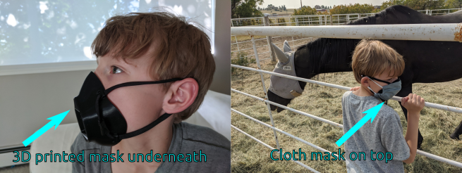
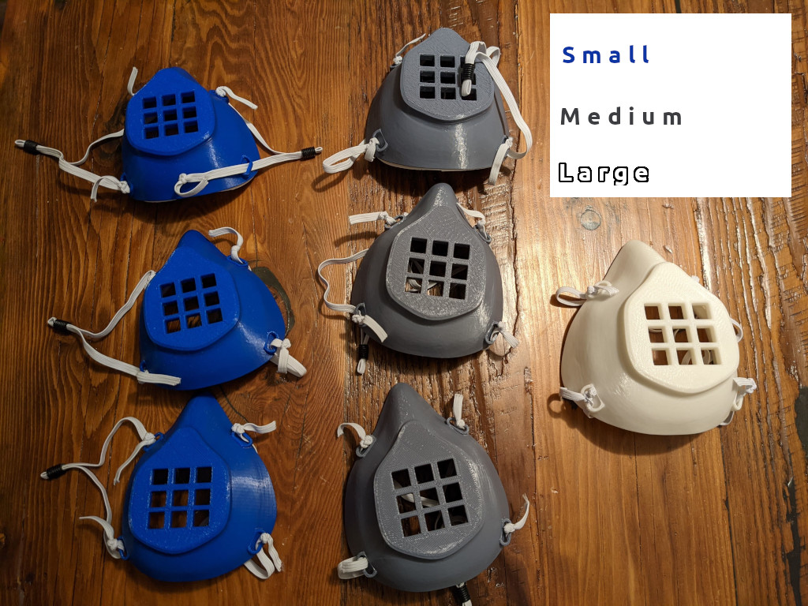
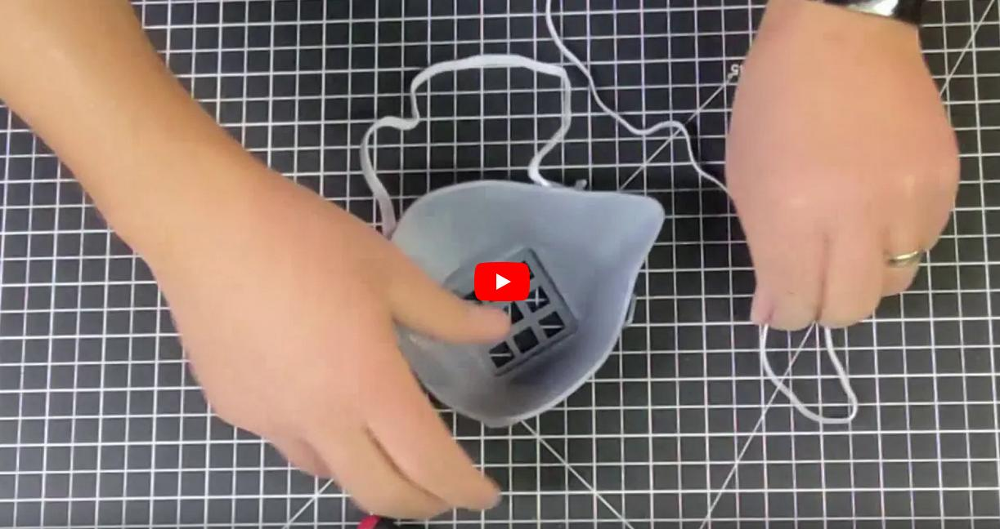
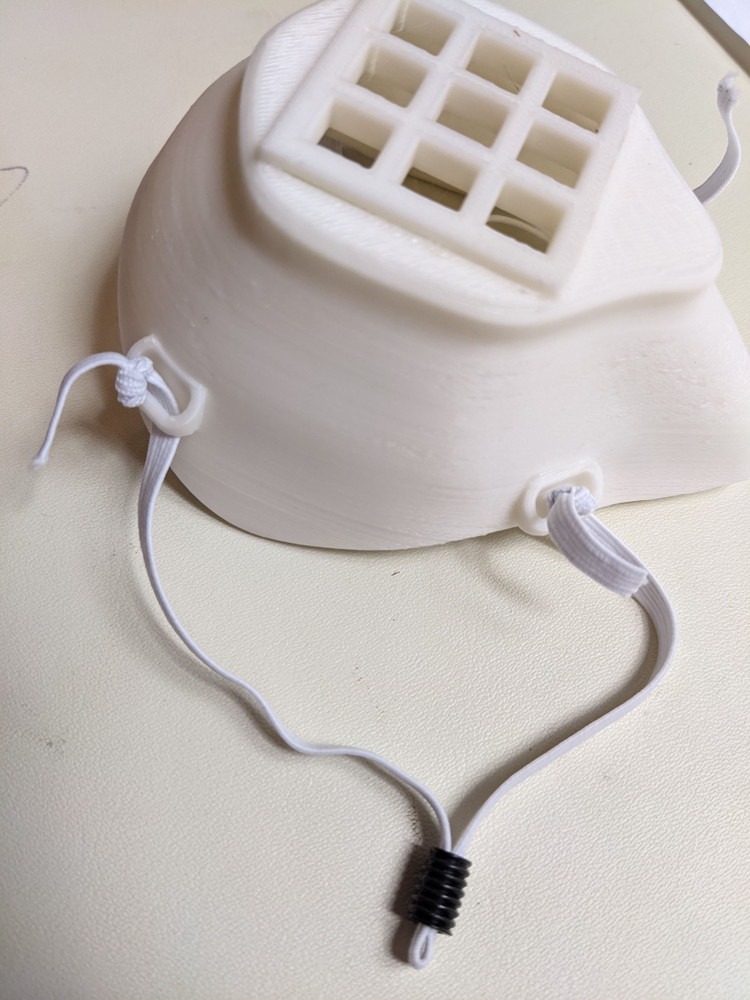
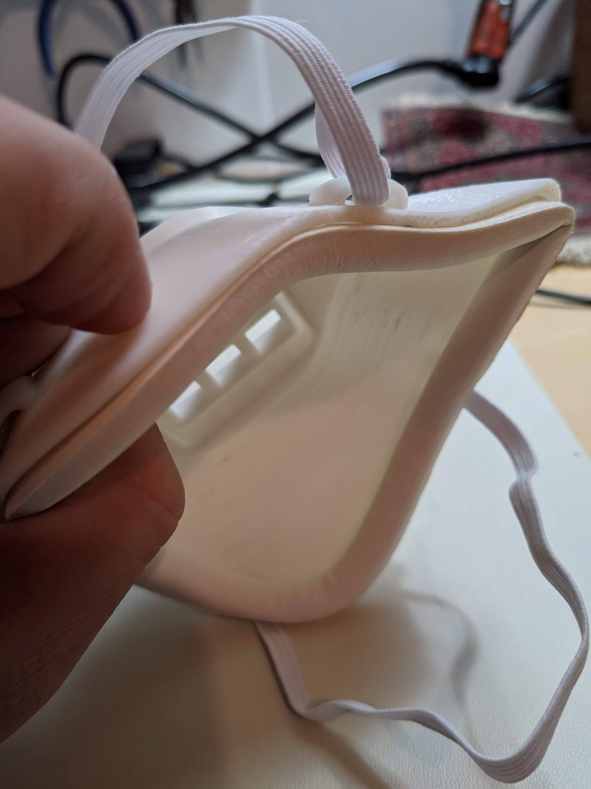

# Special Needs Mask

The Special Needs Mask integrates a grill onto the front of the original Montana V2 mask. This is designed to lift the cloth mask away from the mouth to prevent chewing on the cloth mask. See below for information about the original design, and the Special Needs Mask modifications were made by Cody Sandahl.

## Assembly Instructions
Click to see the assembly video on YouTube, or see the written instructions below.

1. Print the mask in the desired size. Click [here](stls/SpecialNeedsMask.stl) for the Special Needs Mask STL file.
- L: 110%
- M: 100% (most youth and adults)
- S: 90% (most children)
1. Tie eastic to the eyelets. You can sew them or just tie a large knot on each end. Any elastic band can be used, but we used [this one](https://www.amazon.com/gp/product/B087G8ZB8C/)
- L: 16" elastic + 5 knots
- M: 15" elastic + 4 knots
- S: 13" elastic + 3 knots

1. Add ear loop size adjusters if needed (seen in photo above). We used [this one](https://www.amazon.com/gp/product/B08B4QY3TM/)
2. For extra comfort, attach weather strip to the edge of the mask with about 1/8" of the weather strip sticking out above the edge of the mask. We used [this one](https://www.amazon.com/gp/product/B07GQWMC5Q)

[This is a very helpful video on attaching the padding](https://www.youtube.com/watch?v=UkYnSPlj7AI).

## Cleaning Instructions
Use an **alcohol wipe** or **disinfecting wipe** instead of soap and water. Many of the most common 3D printing filaments can be warped by hot water.

## Handouts
You can [download a handout here](handouts/Instructions%20for%20Families.pdf) to give to families who receive these masks.

***

# Original Montana Mask V2
https://github.com/blackbear/make-the-masks

**The Special Needs Mask is a modified version of the Montana Mask V2.**

This is the official "V2" Montana Mask design, based on the original design with design enhancements by J.Scott and Dan Robles. They feature size letters on the mask interior, larger eyelets to make threading elastic easier, and a filter that offers interior relief for the user's lips.

Notes on printing: The filter should be printed with the flange facing up. There is enough contouring on the filter to allow the flange to print without supports.