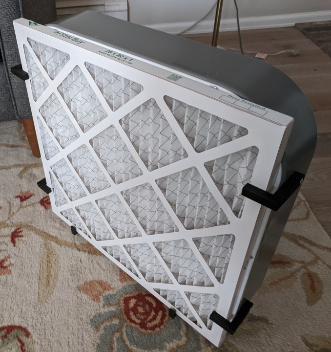
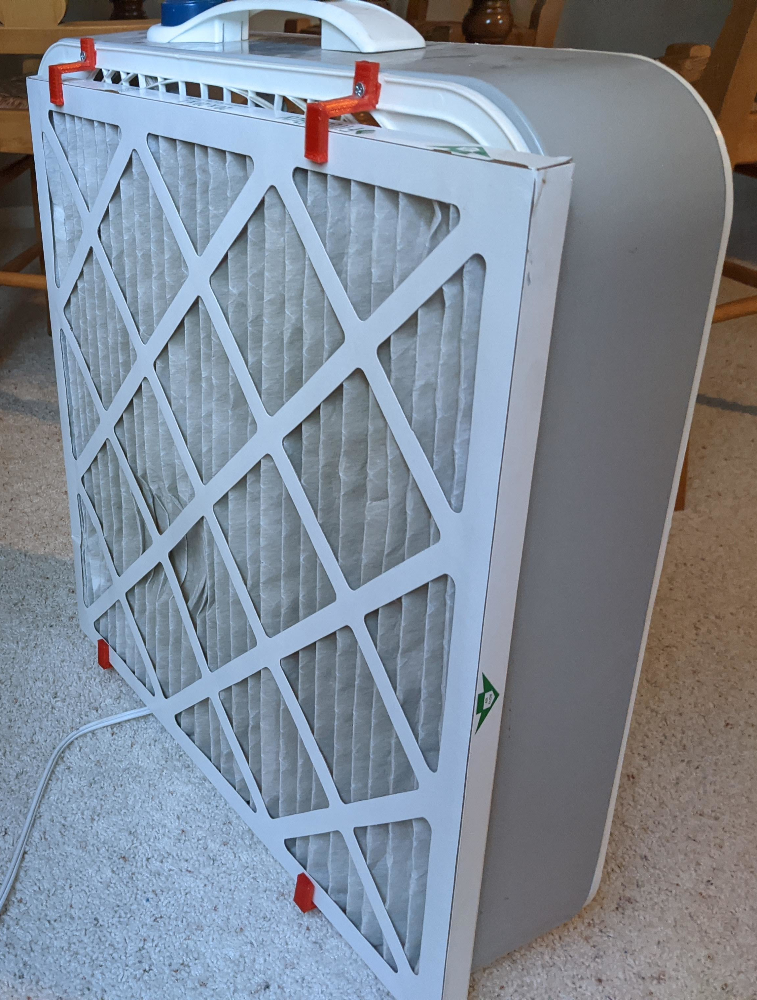
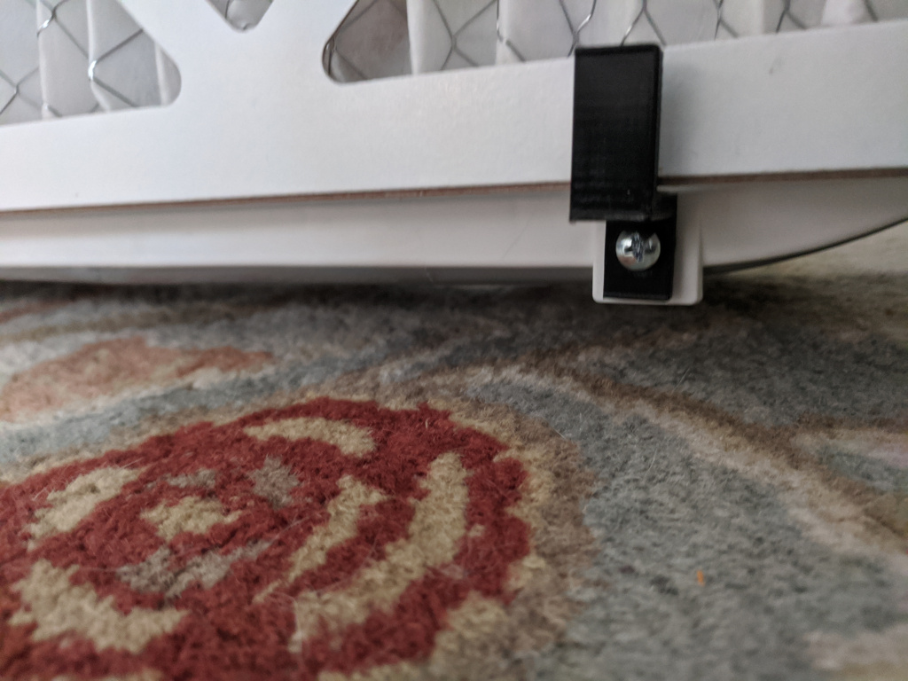
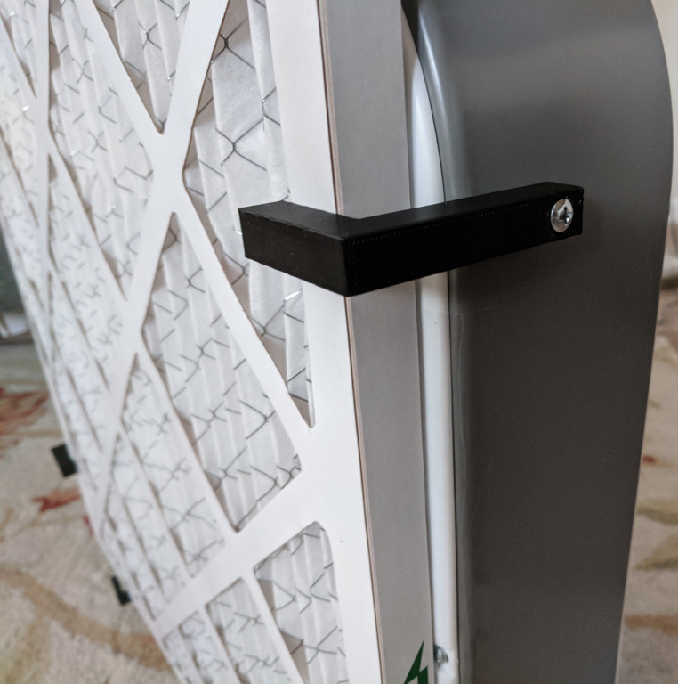

# Box Fan Air Filter
Using a standard 20" box fan and 20x20x1 HVAC air filters, you can have extra indoor ventilation and air filtration.

## Assembly Instructions for Filters Mounted on the Back of the Fan (PREFERRED)

1. Select or purchase a 20" box fan. The controls must not be on the back of the fan to use this method. If the controls are on the back of the fan, use the next set of assembly instructions.
2. Purchase a high quality 20" air filter. Filters with a MERV-13 rating can remove smoke, allergens, and possibly virus particles.
3. 3D print the brackets for your fan.
- Print 4 [FanFilterBottomBracket](stls/FanFilterBottomBracket.stl)
3. Find or purchase sheet metal screws that are long enough to go through the 3D printed bracket and into the fan frame.
4. Determine the 4 mounting holes on the back side of the fan. Most fans have a plastic cover that is attached by 4 sheet metal screws. If possible, re-use these holes. If that's not possible, drill new holes.
5. Attach the 2 bottom brackets first. If you are re-using the fan cover holes, you will first need to remove the existing screws.
- Drill a hole in the 3D printed bracket where you want the screw to go.

1. Attach the 2 top brackets.
- Place your air filter on top of the bottom brackets.
- Line up the top 3D printed bracket with the top of the air filter and the mounting hole. Drill a hole in the 3D printed bracket to finalize the space allowed for the filter.
7. Insert the air filter so that the air flow arrow points **toward the fan**.

## Assembly Instructions for Filters Mounted on the Front of the Fan

1. Select or purchase a 20" box fan.
2. Purchase a high quality 20" air filter. Filters with a MERV-13 rating can remove smoke, allergens, and possibly virus particles.
3. 3D print the brackets for your fan.
- Print 4 [FanFilterSideBracket](stls/FanFilterSideBracket.stl)
- Print 2 [FanFilterBottomBracket](stls/FanFilterBottomBracket.stl)
4. It might be helpful to tape the filter onto the front of the fan to ensure proper spacing of all of the brackets
5. Find or purchase sheet metal screws that are long enough to go through the 3D printed bracket and into the fan frame.
6. Line up the side brackets so they fit *snugly* against the filter. Mark and drill holes at the mount points.
7. Mount the 4 side brackets.

8. Line up the bottom brackets and drill holes in them to determine how high the filter will sit
9.  Mount the 2 bottom brackets. If you are re-using the fan cover holes, you will first need to remove the existing screws.
10. Insert the air filter so that the air flow arrow points **away from the fan**.

